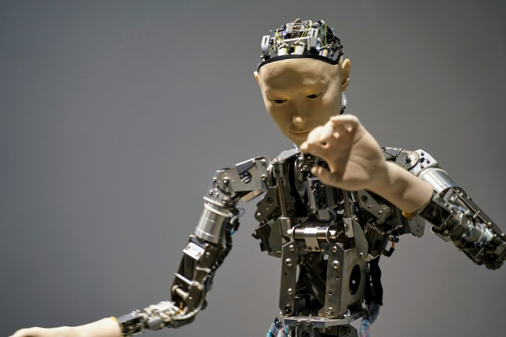

# ICS4U Curriculum - Grade 12 Computer Science Course Outline

ICS4U enables students to further develop knowledge and skills in grade 12 computer science. The ICS4U Curriculum will have Grade 12 Computer Science students use modular design principles to create complex and fully documented programs, according to industry standards. Student teams will manage a large software development project, from planning through to project review. ICS4U students will also analyze algorithms for effectiveness. They will investigate ethical issues in computing and further explore environmental issues, emerging technologies, areas of research in computer science, and careers in the field.

Grade 12 Computer Science is about learning to create more complex software.  It is not about learning how to use the computer, and it is much more than computer programming.  Computer studies is the study of ways of representing objects and processes.  It involves defining problems, analyzing problems, designing solutions, and developing, testing, and maintaining programs.  The major focus of the ICS4U Curriculum is the development of software development skills, which are important for success in future postsecondary studies. Introduction to Computer Science is relevant for all students because it incorporates a broad range of transferable problem solving skills and techniques, including logical thinking, creative design, synthesis and evaluation.  It also teaches generically useful skills in areas such as communication, time management, organization, and teamwork.

You can read the entire [Ontario Computer Studies Curriculum](chrome-extension://efaidnbmnnnibpcajpcglclefindmkaj/https://www.edu.gov.on.ca/eng/curriculum/secondary/computer10to12_2008.pdf) by visiting the Government of Ontario site.  The expectations identified for each course describe the knowledge and skills that students are expected to develop and demonstrate in their class work.

The prerequisite for this course is [ICS3U Grade 11 Computer Science](https://github.com/YuudachiXMMY/ICS3U-Notes).

----

## ICS4U Unit 1 - Fundamental Programming Skills

### ICS4U Curriculum Learning Goals

By the end of this unit ICS4U Grade 12 Computer Science students will be able to

- FILL IN CONTENT LATER

### Lessons for Grade 12 Computer Science

- Getting Started With Python

- Grade 11 Review of Prerequisite Skills

- Recursion

- Programming Evaluation 1

- Two Dimensional Lists

- File Input and Output

- Programming Evaluation 2

- Search Algorithms

- Sorting Algorithms

- Programming Evaluation 3

### Grade 12 Computer Science - Curriculum Expectations

ICS4U Specific Curriculum Expectations

<ul>
  <li>FILL IN CONTENT LATER</li>
</ul>

## ICS4U Unit 2 - Object Oriented Programming (OOP)

### ICS4U Curriculum Learning Goals

By the end of this unit ICS4U Grade 12 Computer Science students will be able to

- FILL IN CONTENT LATER

### Lessons for Grade 12 Computer Science

- Introduction to Object Oriented Programming

- Solving Problems using OOP

- Inheritance and Subclasses

- Polymorphism and Method Overriding

- Programming Evaluation 4

- Creating Python Modules

- Applying OOP with Pygame

- Programming Evaluation 5

### Grade 12 Computer Science - Curriculum Expectations

ICS4U Specific Curriculum Expectations

<ul>
  <li>FILL IN CONTENT LATER</li>
</ul>

## ICS4U Unit 3 - Designing Software Projects

### ICS4U Curriculum Learning Goals

By the end of this unit ICS4U Grade 12 Computer Science students will be able to

- FILL IN CONTENT LATER

### Lessons for Grade 12 Computer Science

- Project Management and Software Design

- Designing a Word Guessing Game with Pygame

- Designing a Card Game with Pygame

### Grade 12 Computer Science - Curriculum Expectations

ICS4U Specific Curriculum Expectations

<ul>
  <li>FILL IN CONTENT LATER</li>
</ul>

## ICS4U Unit 4 - Emerging Technologies

### ICS4U Curriculum Learning Goals

By the end of this unit ICS4U Grade 12 Computer Science students will be able to

- FILL IN CONTENT LATER

### Lessons for Grade 12 Computer Science

- Machine Learning

- Computer Vision

- Applications of Emerging Technologies

- Emerging Technologies Evaluation

### Grade 12 Computer Science - Curriculum Expectations

ICS4U Specific Curriculum Expectations

<ul>
  <li>FILL IN CONTENT LATER</li>
</ul>

----

## ICS4U Curriculum - Assessment and Evaluation

The Ontario Ministry of Education document [Growing Success](chrome-extension://efaidnbmnnnibpcajpcglclefindmkaj/https://www.edu.gov.on.ca/eng/policyfunding/growsuccess.pdf) determines the rules and policies for measuring and communicating achievement in Grade 12 Computer Science

The primary purpose of assessment and evaluation in Grade 12 Computer Science is to improve student learning.  Information gathered through assessment helps teachers to determine students strengths and weaknesses in their achievement or the overall ICS4U curriculum expectations.

### Assessment in Computer Science

The process of assessing student learning is continuous and on-going. Teachers use information gathered through assessments to provide feedback for students, to guide instruction and develop individual learning goals for students. This is assessment for learning. Students use this feedback to continuously improve their achievement and set individual learning goals. This is assessment as learning. Information from assessments informs the teacher’s professional judgment, but is not used in determining the student’s level of achievement.

### Evaluation in ICS4U

Evaluation is the process of determining a level of student achievement of the Overall Expectations for a course, which is recorded as a mid-term or final grade on a report card. Students will be given numerous and varied opportunities to demonstrate their achievement of the Overall Expectations, as defined in the ICS4U curriculum, across the four categories of achievement (Knowledge & Understanding, Thinking, Communication and Application).  Evidence of student achievement of the Overall Expectations is collected over time from three different sources – observations, conversations and student products.

To be successful students must demonstrate achievement of EACH of the Overall Expectations for the course. If a student is missing evidence of achievement of one or more of the Overall Expectations then a lower limit will be determined by the teacher.

Here are the overall expectations for ICS4U Grade 12 Computer Science

ICS4U Curriculum - Strand A - Programming Concepts and Skills

<h4>Overall ICS4U Curriculum Expectations</h4>
<ul>
<li>A1 – Demonstrate the ability to use different data types and expressions when creating computer programs
<li>A2 – Describe and use modular programming concepts and principles in the creation of computer programs
<li>A3 – Design and write algorithms and subprograms to solve a variety of problems
<li>A4 – Use proper code maintenance techniques when creating computer programs
</ul>

ICS4U Curriculum - Strand B - Software Development

<h4>Overall ICS4U Curriculum Expectations</h4>
<ul>
<li>B1 – Demonstrate the ability to manage the software development process effectively, through all of its stages – planning, development, production, and closing
<li>B2 – Apply standard project management techniques in the context of a student-managed team project
</ul>

ICS4U Curriculum - Strand C - Designing Modular Programs

<h4>Overall ICS4U Curriculum Expectations</h4>
<ul>
<li>C1 – Demonstrate the ability to apply modular design concepts in computer programs
<li>C2 – Analyze algorithms for their effectiveness in solving a problem
</ul>

ICS4U Curriculum - Strand D - Topics in Computer Science

<h4>Overall ICS4U Curriculum Expectations</h4>
<ul>
<li>D1 – Assess strategies and initiatives that promote environmental stewardship with respect to the use of computers and related technologies
<li>D2 – Analyze ethical issues and propose strategies to encourage ethical practices related to the use of computers
<li>D3 – Analyze the impact of emerging computer technologies on society and the economy
<li>D4 – Research and report on different areas of research in computer science, and careers related to computer science
</ul>

### Report Card Grade

In determining a report card grade teachers use their professional judgment to interpret the evidence of student achievement which reflects the student’s most consistent level of achievement with special considerations given to the more recent evidence.

The final grade in this ICS4U Computer Science course is determined by the following breakdown:

- 70 % – evaluations made at the end of units throughout the semester.

- 30% – final demonstrations of learning (culminating activities and/or final examinations)
-
All ICS4U assessments have been designed to meet the achievement chart categories in the Ontario ICS4U curriculum.

- **Knowledge and Understanding** – specific content acquired in the course and the comprehension of its meaning and significance.

- **Thinking** – The use of critical and creative thinking skills and processes.  It involves planning skills (focusing research, gathering information, selecting strategies, organizing a project).  Processing skills (analyzing, interpreting, assessing, reasoning, generating ideas, evaluating, synthesizing, seeking a variety of perspectives). Critical and creative thinking processes (problem solving, decision making, research)

- **Communication** – The conveying of meaning through various forms

- **Application** – The use of knowledge and skills to make connections within and between various contexts

The following are the Levels of Achievement for ICS4U:

- Level 4 (80% – 100%) Exceeds the provincial standard. The student demonstrates the specified knowledge and skills with a high degree of effectiveness.

- Level 3 (70% – 79%) The provincial standard for achievement. The student demonstrates the specified knowledge and skills with considerable effectiveness. Parents of students achieving at level 3 can be confident that their children will be prepared for work in subsequent grades/courses

- Level 2 (60% – 69%) Achievement that approaches the provincial standard. The student demonstrates the specified knowledge and skills with some effectiveness. Students performing at this level need to work on identified learning gaps to ensure future success.

- Level 1 (50% – 59%) Falls much below the provincial standard. The student demonstrates the specified knowledge and
skills with limited effectiveness. Students must work at significantly improving learning in specific areas, as necessary, if they are to be successful in the next grade/course.

----

## Topics and Lessons in ICS4U Introduction to Computer Science Grade 12

### Course Content

#### ICS4U - Unit 1 - Fundamental Programming Skills

- ICS4U – Getting Started With Python

- ICS4U – Grade 11 Review Using Python

- ICS4U – Recursion in Python

- ICS4U – Python Programming Evaluation 1

- ICS4U – Python Two Dimensional Lists

- ICS4U – File Input and Output in Python

- ICS4U – Python Programming Evaluation 2

- ICS4U – Python Search Algorithms

- ICS4U – Python Sorting Algorithms

- ICS4U – Python Algorithm Efficiency

- ICS4U – Python Programming Evaluation 3

#### ICS4U - Unit 2 - Object Oriented Programming (OOP)

- ICS4U – Introduction to Object Oriented Programming in Python

- ICS4U – Solving Problems using OOP

- ICS4U – Advanced Object Oriented Programming in Python

- ICS4U – Python Programming Evaluation 4

- ICS4U – Creating Python Modules

- ICS4U – Applying OOP with Pygame

- ICS4U – Python Programming Evaluation 5

#### ICS4U - Unit 3 - Designing Software Projects

- ICS4U – Project Management in Software Design

- ICS4U – Designing a Word Guessing Game

- ICS4U – Designing a Card Game

- ICS4U – Python Programming Evaluation 6

#### ICS4U - Unit 4 - Emerging Technologies

- ICS4U – Artificial Intelligence

- ICS4U – Machine Learning in Python

- ICS4U – Generative AI

- ICS4U – Computer Vision Using Python

- ICS4U – Emerging Technologies Evaluation
